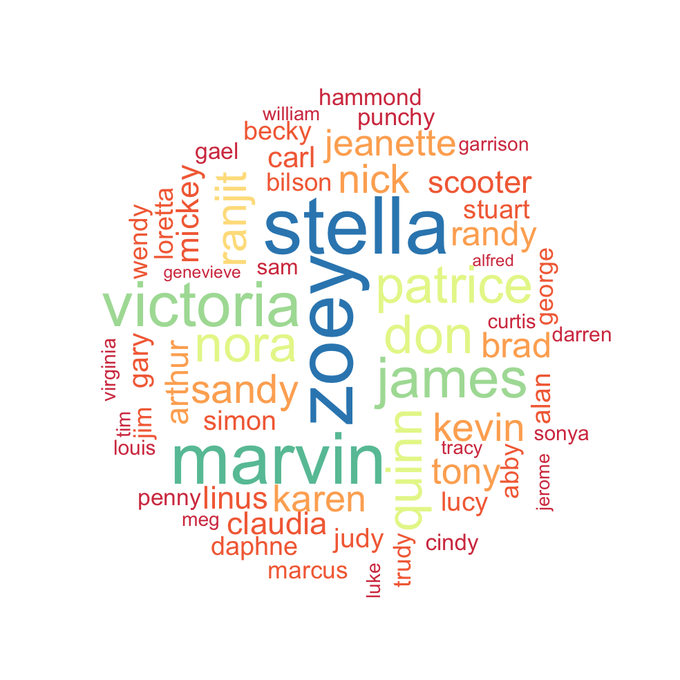
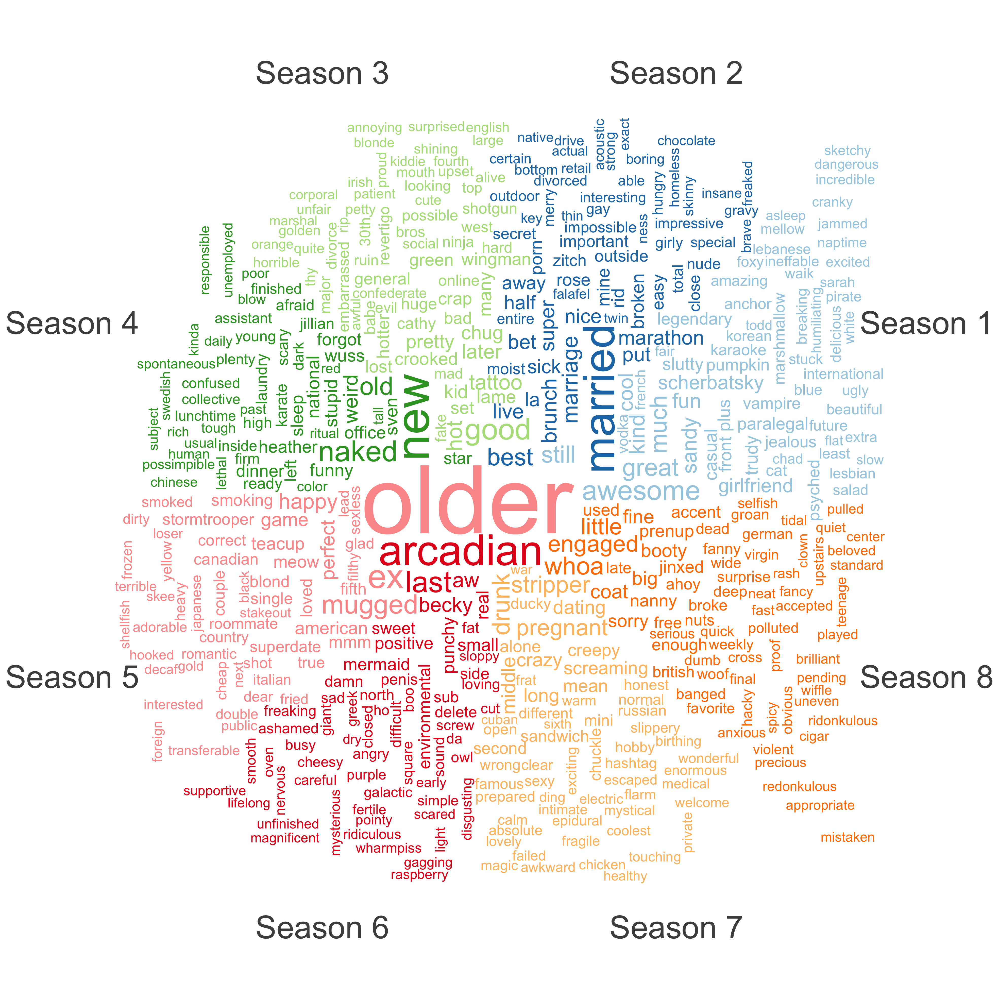

```{r setup, include=FALSE}
knitr::opts_chunk$set(echo = TRUE, message = FALSE, warning = FALSE)

load("data/df_himym_final_doc.Rdata")
load("data/df_characters_w.Rdata")
load("data/df_spaCyr_himym.Rdata")

```

***

```{r set image, out.width="200px", fig.align = 'center', size = 'tiny', echo=FALSE}
h_url <- "https://bit.ly/3xWexDQ"

knitr::include_graphics(h_url)


```

<font size="4">

<center><strong> MSc. Data Science for Public Policy </strong></center>

</font>

------------------------------------------------------------------------

<font size="4">

<center><strong> IDS Workshop 2022 </strong></center>

</font>

------------------------------------------------------------------------

<font size="3">

<center><strong>Introduction to Data Science</strong></center>

</font>

<font size="3">

<center><strong>Professor </strong>: Simon Munzert, PhD.</center>

</font> <font size="3">

</font>

<font size="2">

<center>Students name: <strong>Jorge Roa, Augusto Fonseca, Alexander Kraess </strong></center>

</font>

------------------------------------------------------------------------

# 📌 Objective

</br>

This workshop aims to use the incredible `quanteda` package to analyze the television series "How I Met Your Mother" and demonstrate many of the `quanteda` package’s tools. We will explore the characters, identify adjectives, render Wordclouds, network plots and even sentiment analysis. 

------------------------------------------------------------------------

# 🎸 How I Met Your Mother

</br>

```{r himym, out.width="500px", fig.align = 'center', size = 'tiny', echo=FALSE}
h_url <- "https://prod-ripcut-delivery.disney-plus.net/v1/variant/disney/BEA544D7476F6C33E23CB73494F462BAF5F9A247B41B335F74094773F4112C03/scale?width=1200&aspectRatio=1.78&format=jpeg"

knitr::include_graphics(h_url)
```

</br>

<blockquote> Plot: "Ted has fallen in love. It all started when his best friend, Marshall, drops the bombshell that he plans to propose to longtime girlfriend Lily, a kindergarten teacher. Suddenly, Ted realizes that he had better get a move on if he hopes to find true love. Helping him in the quest is Barney, a friend with endless -- often outrageous -- opinions, a penchant for suits and a foolproof way to meet women. When Ted meets Robin, he is sure it's love at first sight, but the affair fizzles into friendship. Voice-over by Bob Saget ("Full House") tells the story through flashbacks."</blockquote>

Source: [Rotten Tomatoes](https://ds3.ai/courses/textasdata.html){target="_blank"}

------------------------------------------------------------------------

## 🎸 Principal Characters

</br>

::: columns
::: {.column width="20%"}

<center>

```{r, echo=FALSE, out.width="70%", out.height="70%", out.extra='class="myimg"'}
knitr::include_graphics("https://upload.wikimedia.org/wikipedia/en/thumb/e/e0/Ted_Mosby.jpg/220px-Ted_Mosby.jpg")
```

Ted

Actor: Josh Radnor

</center>


:::

::: {.column width="20%"}
<center>

```{r, echo=FALSE, out.width="70%", out.height="70%", out.extra='class="myimg"'}
knitr::include_graphics("https://pbs.twimg.com/media/Ck8_vkfVEAAQldJ.jpg")
```

Barney

Actor: Neil 
Patrick Harris

</center>
:::

::: {.column width="20%"}
<center>

```{r, echo=FALSE, out.width="70%", out.height="70%", out.extra='class="myimg"'}
knitr::include_graphics("https://iv1.lisimg.com/image/7068531/740full-robin-scherbatsky.jpg")
```

Robin

Actor: Cobin Smulders

</center>
:::

::: {.column width="20%"}
<center>

```{r, echo=FALSE, out.width="70%", out.height="70%", out.extra='class="myimg"'}
knitr::include_graphics("https://upload.wikimedia.org/wikipedia/en/a/a6/Marshall_Eriksen.jpg")
```

Marshall

Actor: Jason Segel

</center>


:::

::: {.column width="20%"}
<center>

```{r, echo=FALSE, out.width="70%", out.height="70%", out.extra='class="myimg"'}
knitr::include_graphics("https://cdn.fansshare.com/photo/alysonhannigan/lily-stills-lily-aldrin-alyson-hannigan-1247118600.jpg")
```

Lily

Actor: Alyson Hannigan

</center>
:::
:::

------------------------------------------------------------------------

<blockquote> "The story of five friends sitting in their favorite booth at MacLaren’s, their lives unfolding in front of each other, How I Met Your Mother is heartwarming and hilarious at the same time. Some believe that HIMYM is Ted’s story. Others think that it is Marshall and Lily’s story. And there’s a whole school of thought that it's no one else but Barney’s story. We would like to think that it’s all of their stories because there won’t be a Ted without Barney or a Lily without Marshall, and definitely no Robin without a Ted (and Barney too). That’s how crucial each of the members of this group is, playing a major role in each other’s lives, helping them grow and become what they wanted to be." </blockquote> 

Source: [Collider](https://collider.com/how-i-met-your-mother-cast-and-characters-what-now/){target="_blank"}

------------------------------------------------------------------------

<center>


## 🎭 Let's Start


{fig-align="center" height="300"}

</center>
------------------------------------------------------------------------

# 📕 Libraries

These will be the libraries we will use for our analysis. In every line, you will find the purpose of it.

```{r libraries, eval = TRUE}

library(readtext) #For import and Handling for Plain and Formatted Text Files.
library(rvest) #For easily Harvest (Scrape) Web Pages.
library(xml2) #For working with XML files using a simple, consistent interface.
library(polite) #For be responsible when scraping data from websites.
library(httr) #Package for working with HTTP organised by HTTP verbs 
library(tidyverse) #Opinionated collection of R packages designed for data science.
library(tidytext) #Functions and supporting data sets to allow conversion of text.
library(quanteda) #OUR PACKAGE for text analysis. 
library(quanteda.textstats) #OUR SUBPACKAGE for text statistics. 
library(quanteda.textplots) #OUR SUBPACKAGE for text plots. 
library(stringr) #Consistent Wrappers for Common String Operations.
library(spacyr) #NLP package that comes from Python that help us classify words.
library(ggsci) #Collection of high-quality color palettes.
library(ggrepel) # ggrepel provides geoms for ggplot2 to repel overlapping text labels
library(RColorBrewer) #Beautifull color palettes.
library(cowplot) #Package to put images in our plots.
library(magick) #Package for save images in our environment
library(gghighlight) #gghighlight() adds direct labels for some geoms.

#Set image
obj_img <- image_read(path = "https://bit.ly/3twmH2Y")

```

# 🧞 Web scrap TV shows scripts

We will do a web scraping of our favorite TV show: “How I Met Your Mother.” For the above, we will do web scraping to obtain the scripts of the 208 episodes that the TV show has. We will define the URLs, obtain the information to know if we can do web scraping, and name the directory where we want to save our files.

## 🧵 Define URLS and read HTML

</br>

-   This chunk of code shows how we can retrieve data from the internet. For our purpose, we will use [Sprigfield](springfieldspringfield.co.uk) webpage. Here, you can download the original TV scripts from multiple shows; in our case, we will download the How I Met Your Mother scripts.

```{r 02.01, eval = FALSE, class.source = "fold-show"}

v_tv_show <- "how-i-met-your-mother"

v_url_web <- "http://www.springfieldspringfield.co.uk/"

#Remember to be polite and know if we can web scrap the webpage
session_information <- bow(v_url_web) #Do a bow with the polite package
session_information

v_url <- paste(v_url_web,"episode_scripts.php?tv-show=", v_tv_show, sep="")

#Identify yourself
rvest_himym <- session(v_url, 
                       add_headers(`From` = "jurjoo@gmail.com", 
                                   `UserAgent` = R.Version()$version.string))

#Start web scrap
html_url_scrape <- rvest_himym %>% read_html(v_url)

node_selector <- ".season-episode-title"

directory_path <- paste("texts/how-i-met-your-mother/", v_tv_show, sep = "")


```

------------------------------------------------------------------------

##🪡 Loop for download TV scripts

</br>

```{r 02.02.01., eval = FALSE, class.source = "fold-show"}

### scrape href nodes in .season-episode-title-------------------------

html_url_all_seasons <- html_nodes(html_url_scrape, node_selector) %>%
  html_attr("href")

### One loop for all our URL's----------------------------------------

for (x in html_url_all_seasons) {
  read_ur <- read_html(paste(v_url_web, x, sep="/"))
  
  Sys.sleep(runif(1, 0, 1)) #Be polite
  
  # Element node that was checked and that contain the place of the scripts.
  selector <- ".scrolling-script-container"
  # Scrape the text
  text_html <- html_nodes(read_ur, selector) %>% 
    html_text()
  
  # Last five characters of html_url_all_seasons for saving this to separate text files (This is our pattern).
  sub_data <- function(x, n) {
    substr(x, nchar(x) - n + 1, nchar(x))
  }
  seasons_final <- sub_data(x, 5)
  # Write each text file
  write.csv(text_html, file = paste(directory_path, "_", seasons_final, ".txt", sep=""), row.names = FALSE)
}


```

------------------------------------------------------------------------

# 🎨 Webscrapp TV Show tables


------------------------------------------------------------------------

## 🎭 Information about TV episodes

</br>

```{r 03.01., eval = TRUE, class.source = "fold-show"}

url_himym <- "https://en.wikipedia.org/wiki/List_of_How_I_Met_Your_Mother_episodes"

rvest_himym_table <- session(url_himym, 
                             add_headers(`From` = "jurjoo@gmail.com", 
                                         `UserAgent` = R.Version()$version.string))

l_tables_himym <- rvest_himym_table %>% 
  read_html() %>% 
  html_nodes("table") %>% 
  html_table(fill = TRUE)

#This generates a list with all the tables that contain the page. In our case, 
#we want the table from the second element till the 10th. 
l_tables_himym <- l_tables_himym[c(2:10)]

l_tables_himym[1]
```


------------------------------------------------------------------------

### Data cleaning to wrangle html tables (Characters of the TV show)

</br>

```{r 03.01.01, eval = TRUE, class.source = "fold-show"}

#Reduce the list in one data frame since all of the tables share the same structure 
df_himym <- data.frame(Reduce(bind_rows, l_tables_himym)) 


#We do the same for the characters of HIMYM
url_himym_characters <- "https://en.wikipedia.org/wiki/List_of_How_I_Met_Your_Mother_characters"

rvest_himym_table_2 <- session(url_himym_characters, 
                               add_headers(`From` = "jurjoo@gmail.com", 
                                           `UserAgent` = R.Version()$version.string))

l_tables_himym_characters <- rvest_himym_table_2 %>% 
  read_html() %>% 
  html_nodes("table") %>% 
  html_table(fill = TRUE)

df_characters <- as.data.frame(l_tables_himym_characters[[1]]) %>% 
  select(Character)

df_characters_w <- df_characters %>% 
  filter(!stringr::str_starts(Character, "Futu"),
         !(Character %in% c("Character", "Main Characters", 
                            "Supporting Characters"))) %>% 
  mutate(name = str_extract(Character,"([^ ]+)"),
         name = replace(name, name == "Dr.", "Sonya"))

df_characters_w
```

------------------------------------------------------------------------

###  Data cleaning to wrangle html tables (Information of the TV Show)

</br>

```{r 03.01.02, eval = TRUE}


#We bind the tables with bind_rows
df_himym <- data.frame(Reduce(bind_rows, l_tables_himym)) 

df_himym_filt <- df_himym %>% filter(str_length(No.overall) < 4)

df_himym_filt_dupl <- df_himym %>% filter(str_length(No.overall) > 4)

#We are doing this particular wrangling to format in the best possible way our tables. 

#Note that we are using stringr to manipulate our characters.

df_himym_filt_dupl_1 <- df_himym_filt_dupl %>% 
  mutate(No.overall = as.numeric(replace(No.overall, str_length(No.overall) > 4, substr(No.overall, 1, 3))),
         No..inseason = as.numeric(replace(No..inseason, str_length(No..inseason) > 3, substr(No..inseason, 1, 2))),
         Prod.code = replace (Prod.code, str_length(Prod.code) > 3, substr(Prod.code, 1, 6)))

df_himym_filt_dupl_2 <- df_himym_filt_dupl %>% 
  mutate(No.overall = as.numeric(replace(No.overall, str_length(No.overall) > 4, substr(No.overall, 4, 6))),
         No..inseason = as.numeric(replace(No..inseason, str_length(No..inseason) > 3, substr(No..inseason, 3, 4))),
         Title = replace(Title, Title == "\"The Magician's Code\"", "\"The Magician's Code Part 2\""),
         Title = replace(Title, Title == "\"The Final Page\"", "\"The Final Page Part 2\""),
         Title = replace(Title, Title == "\"Last Forever\"" , "\"Last Forever Part 2\"" ),
         Prod.code = replace(Prod.code, str_length(Prod.code) > 3, substr(Prod.code, 7, 12)))

df_himym_final <- bind_rows(df_himym_filt, 
                            df_himym_filt_dupl_1, 
                            df_himym_filt_dupl_2) %>% 
  arrange(No.overall, No..inseason) %>% 
  mutate(year = str_extract(Original.air.date, '[0-9]{4}+'),
         Season = as.numeric(stringr::str_extract(Prod.code, "^.{1}"))) %>% 
  rename(Chapter = No..inseason)

df_himym_final$US.viewers.millions. <- as.numeric(str_replace_all(df_himym_final$US.viewers.millions., "\\[[0-9]+\\]", ""))

df_himym_final

```

------------------------------------------------------------------------

## 🎛  Load TV scripts and merge tables

</br>

```{r 04.01, eval = TRUE}

df_texts_himym <- readtext::readtext("texts/how-i-met-your-mother/*.txt")

v_season <- as.numeric(stringr::str_extract(df_texts_himym$doc_id, "\\d+"))

v_chapter <- as.numeric(stringi::stri_extract_last_regex(df_texts_himym$doc_id, "[0-9]+"))

df_texts_himym_w <- df_texts_himym %>% mutate(Season = v_season, Chapter = v_chapter)

df_himym_final_doc <- full_join(as.data.frame(df_texts_himym_w), df_himym_final, by = c("Season", "Chapter")) %>% 
  mutate(Season_w = paste("Season", Season),
         Title_season = paste0(Title, " S", Season, " EP", Chapter))

df_himym_final_doc

```

Press the arrows in the top right corner of this interactive dataframe. As you can see, we have our final dataframe with the information our our TV show, number of season, episode, etc.


------------------------------------------------------------------------

# 🎨 Quanteda (Corpus, Token and DFM)

------------------------------------------------------------------------

## 🧥 First step: Define a corpus

</br>

Look our corpus, it's divided into types, tokens and even sentences. 

```{r 05.01, eval = TRUE, class.source = "fold-show"}

corp_himym <- corpus(df_himym_final_doc)  #Build a new corpus from the texts

docnames(corp_himym) <- df_himym_final_doc$Title

summary(corp_himym, n = 15)

```


------------------------------------------------------------------------

## 🥽 Second step: Convert corpus into tokens and wrangle it

</br>

Look our tokenization, we separate our text into words. Amazing!


```{r 05.02, eval = TRUE, class.source = "fold-show"}

corp_himym_stat <- corp_himym

docnames(corp_himym_stat) <- df_himym_final_doc$Title_season


corp_himym_s1_simil <- corpus_subset(corp_himym_stat, Season == 1) #We want to analyze just the first season


toks_himym_s1 <- tokens(corp_himym_s1_simil, #corpus from all the episodes from the first season
                        remove_punct = TRUE, #Remove punctuation of our texts
                        remove_separators = TRUE, #Remove separators of our texts
                        remove_numbers = TRUE, #Remove numbers of our texts
                        remove_symbols = TRUE) %>% #Remove symbols of our texts
  tokens_remove(stopwords("english")) #Remove stop words of our texts

toks_himym_s1

```


------------------------------------------------------------------------

## 🧩 Third step: Convert our tokens into a Document Feature Matrix

</br>

Please, take a look into our Document Feature Matrix. Look know how it is counting our ocurreces. We can do multiple things with them. 

```{r 05.03, eval = TRUE, class.source = "fold-show"}

toks_himym_dm_s1 <- toks_himym_s1 %>% 
                    dfm() #Convert our tokens into a document feature matrix

toks_himym_dm_s1

```

------------------------------------------------------------------------

# 🏆 Quanteda analysis

------------------------------------------------------------------------

</br>

## 🎯 Similarity between episodes

textstat_simil function we will find the similarity between episodes

</br>

```{r 05.04, eval = FALSE, class.source = "fold-show"}

tstat_simil <- textstat_simil(toks_himym_dm_s1) #Check similarity between episodes of the first season

clust <- hclust(as.dist(tstat_simil)) #Convert our object into a cluster (For visualization purposes)

dclust <- as.dendrogram(clust)  #Convert our cluster into a dendrogram (For visualization purposes)

dclust <- reorder(dclust, 1:22) #Order our visualization

```


```{r 05.04 ploy, eval = FALSE}

#Seetle colors
nodePar <- list(lab.cex = 1, pch = c(NA, 19), 
                cex.axis = 1.5,
                cex = 2, col = "#0080ff")

par(mar = c(18.1, 6, 2, 3))

#Plot dendogram
plot(dclust, nodePar = nodePar,
     las = 1,
     cex.axis = 2, cex.main = 2, cex.sub = 2,
     main = "How I Met Your Mother Season 1",
     type = "triangle",
     ylim = c(0,1),
     ylab = "",
     edgePar = list(col = 4:7, lwd = 7:7),
     panel.first = abline(h = c(seq(.10, 1, .10)), col = "grey80"))

title(ylab = "Similarity between episodes (correlation %)", mgp = c(4, 1, 1), cex.lab = 2)    

rect.hclust(clust, k = 5, border = "red")

```

Look how amazing the similairty it is. 

</br>

```{r similarity, fig.align = 'center', size = 'tiny', echo=FALSE}


knitr::include_graphics("images/similarity.png")


```


------------------------------------------------------------------------


## 🪅 Distance between episodes

textstat_dist function. Here distance is the opposed of similarity. More distance equals less similar. 

```{r 05.06, eval = FALSE, class.source = "fold-show"}

tstat_simil <- textstat_simil(toks_himym_dm_s1) #Check similarity between episodes of the first season

clust <- hclust(as.dist(tstat_simil)) #Convert our object into a cluster (For visualization purposes)

dclust <- as.dendrogram(clust)  #Convert our cluster into a dendrogram (For visualization purposes)

dclust <- reorder(dclust, 1:22) #Order our visualization

```

```{r 05.06 plot, eval = FALSE}


par(mar = c(21, 6, 2, 3))

#Plot dendogram
plot(dclust_dist, nodePar = nodePar_2,
     las = 1,
     cex.axis = 2, cex.main = 2, cex.sub = 2,
     main = "How I Met Your Mother Season 1",
     type = "triangle",
     ylim = c(0, 120),
     ylab = "",
     edgePar = list(col = 11:19, lwd = 7:7),
     panel.first = abline(h = c(seq(10, 120, 10)), col = "grey80"))

title(ylab = "Distance between episodes (correlation %)", mgp = c(4, 1, 1), cex.lab = 2)    

rect.hclust(clust, k = 5, border = "red")

```

```{r distance, fig.align = 'center', size = 'tiny', echo=FALSE}


knitr::include_graphics("images/distance.png")


```


------------------------------------------------------------------------


## 🎎 Appearances of actors by season

We will get the number of appearances by actor per season and episode. 

```{r 07, eval = TRUE}

#Remember our second step: tokenize our corpus. 

toks_himym <- tokens(corp_himym, #corpus from all the episodes from the first season
                     remove_punct = TRUE, #Remove punctuation of our texts
                     remove_separators = TRUE,  #Remove separators of our texts
                     remove_numbers = TRUE, #Remove numbers of our texts
                     remove_symbols = TRUE) %>% #Remove symbols of our texts
  tokens_remove(stopwords("english")) #Add additional words

dfm_actors <- toks_himym %>% 
  tokens_select(c("Ted", "Marshall", "Lily", "Robin", "Barney", "Mother")) %>% #We just want to analyze these characters
  tokens_group(groups = Season) %>% #We group our tokens (scripts) by season
  dfm() #Transform the token into a DFM object

df_final_actors <-  as.data.frame(textstat_frequency(dfm_actors, groups = c(1:9))) %>% 
                    mutate(Season = paste("Season", group),
                           `Principal Characters` = replace(feature, is.character(feature), str_to_title(feature))) %>% 
                    select(-feature)

df_final_actors
```


Here, we plot this frequency of actors

```{r 07.01, eval = TRUE, fig.height=8, fig.width=9}

# Plot frequency of actors
ggplot1 <- ggplot(df_final_actors, aes(x = group, y = frequency, group = `Principal Characters`, color = `Principal Characters`)) +
  geom_line(size = 1.5) +
  scale_color_manual(values = brewer.pal(n = 6, name = "Dark2")) +
  geom_point(size = 3.2) +
  scale_y_continuous(breaks = seq(0, 5600, by = 50), limits = c(0,560))+
  theme_minimal(base_size = 14) +
  labs(x = "Number of Season",
       y = "Frequencies of appreances",
       title = "Appearances of principal characters by Season",
       caption="Description: This plot show the number of times that the \n principal characters appears in HIMYM per season.")+
       theme(panel.grid.major=element_line(colour="#cfe7f3"),
             panel.grid.minor=element_line(colour="#cfe7f3"),
             plot.title = element_text(margin = margin(t = 10, r = 20, b = 30, l = 30)),
             #axis.text.x=element_text(size=15),
             #axis.text.y=element_text(size=15),
             plot.caption=element_text(size=12, hjust=.1, color="#939393"),
             legend.position="bottom",
             plot.margin = margin(t = 20,  # Top margin
                                  r = 50,  # Right margin
                                  b = 40,  # Bottom margin
                                  l = 10), # Left margin
             text=element_text()) + 
#geom_segment(aes(x = 8.5, y = 75, xend = 8.8, yend = 70),
#             arrow = arrow(length = unit(0.1, "cm")))+
  guides(colour = guide_legend(ncol = 6))

ggdraw(ggplot1) + draw_image(obj_img, x = .97, y = .97, 
                               hjust = 1.1, vjust = .7, 
                               width = 0.11, height = 0.1)
```


------------------------------------------------------------------------

## 🌊 Wordcloud of PRINCIPAL characters that appears in HIMYM

Wordcloud plots are super useful to realize how many words and the repetition of them in a text. 

```{r 08.0, eval = TRUE, class.source = "fold-show"}

#Remember our second step: tokenize our corpus. 

toks_himym_characters <- tokens(corp_himym, #corpus from all the episodes from all season
                                remove_punct = TRUE, #Remove punctuation of our texts
                                remove_separators = TRUE, #Remove separators of our texts
                                remove_numbers = TRUE, #Remove numbers of our texts
                                remove_symbols = TRUE) %>% #Remove symbols of our texts
  tokens_keep(c(unique(df_characters_w$name))) #This function allow us to keep just the tokens that we want. 

#In this case, we just want the characters.

toks_himym_characters
```

```{r 08.01, eval = TRUE, class.source = "fold-show"}

#Remember our third step: DFM object

dfm_general_characters <- toks_himym_characters %>%
                          dfm()


#In this case, we just want the characters.

toks_himym_characters
```

```{r 08.01 word, eval = FALSE, class.source = "fold-show"}

textplot_wordcloud(dfm_general_characters, 
                   rotation = 0.25,
                   min_size = 1.4, max_size = 8,
                   min_count = 1, #Minimum frequency
                   color = brewer.pal(11, "RdBu"))
#RColorBrewer::display.brewer.all()
```


```{r wordcloud, fig.align = 'center', size = 'tiny', echo=FALSE}


knitr::include_graphics("images/wordcloud_princ.png")


```

------------------------------------------------------------------------

## ☄ Wordcloud of SECONDARY characters that appears in HIMYM

Now, we do the same, but with our seconday characters.

```{r 08, eval = TRUE, class.source = "fold-show"}

#Remember our second step: tokenize our corpus. 

toks_himym_sec_characters <- tokens(corp_himym, #corpus from all the episodes from all season
                                    remove_punct = TRUE, #Remove punctuation of our texts
                                    remove_separators = TRUE, #Remove separators of our texts
                                    remove_numbers = TRUE, #Remove numbers of our texts
                                    remove_symbols = TRUE) %>% #Remove symbols of our texts
  tokens_keep(c(unique(df_characters_w$name))) %>% #We want to keep all the characters
  tokens_remove(c("Ted", "Barney", "Lily", "Robin", "Marshall")) #But we remove the principal characters

```


```{r 08.01_sec, eval = TRUE, class.source = "fold-show"}

#Remember our third step: DFM object

dfm_general_sec_characters <- toks_himym_sec_characters %>%
                              dfm()

```

```{r 08.01 word_sec, eval = FALSE, class.source = "fold-show"}

textplot_wordcloud(dfm_general_sec_characters, 
                   random_order = FALSE, 
                   rotation = 0.25,
                   min_size = 1, max_size =5,
                   labelsize = 1.5,
                   min_count = 1, #Minimum frequency
                   color = RColorBrewer::brewer.pal(8, "Spectral"))
```


```{r wordcloud_sec, fig.align = 'center', size = 'tiny', echo=FALSE}





```

------------------------------------------------------------------------

# 🔥 spaCy and spaCyr

spacyr provides a convenient R wrapper around the Python spaCy package. It offers easy access to the following functionality of spaCy.
This package is amazing because here what spacyr is doing is clasifying automatically our words into nouns, adjectives, verbs, dates and much more.

Of course, it is not 100% accurate, but it is an amazing tool to do some analysis!

{fig-align="center" height="100"}

------------------------------------------------------------------------

```{r 10_spacy, eval = FALSE, class.source = "fold-show"}

library(spacyr)

spacy_install()

spacy_initialize(model = "en_core_web_sm")

sp_parse_doc <- spacy_parse(df_himym_final_doc, tag=TRUE)

```

```{r 10_01_doc, eval = TRUE, class.source = "fold-show"}

sp_parse_doc

```

```{r 10_01_var, eval = TRUE, class.source = "fold-show"}

sp_parse_var <- full_join(sp_parse_doc, df_himym_final_doc, by = c("doc_id"))

#In this case, we will just look the proper names and adjectives.

sp_parse_var_PROPN <- sp_parse_var %>% filter(pos=="PROPN" & stringr::str_starts(entity, "PERSON_B"))

sp_parse_var_ADJ <- sp_parse_var %>% filter(pos=="ADJ")

```

------------------------------------------------------------------------


## ⛄ Get wordcloud using an spaCyr output

We will get a wordcloud using the spacYr output. We will divide for this examples into adjectives and other features. Please, checl the package, it's amazing.

```{r 08_tok_adj, eval = TRUE, class.source = "fold-show"}

#Remember our second step: tokenize our corpus. 

toks_himym_ADJ <- tokens(corp_himym, #corpus from all the episodes from all season
                         remove_punct = TRUE, #Remove punctuation of our texts
                         remove_separators = TRUE,  #Remove separators of our texts
                         remove_numbers = TRUE, #Remove numbers of our texts
                         remove_symbols = TRUE) %>%  #Remove symbols of our texts
  tokens_keep(c(unique(sp_parse_var_ADJ$lemma))) %>% #We want to keep all the adjective
  tokens_remove(c(stopwords("english"), "oh", "yeah", "okay", "like", 
                  "get", "got", "can", "one", "hey", "go",
                  "Ted", "Marshall", "Lily", "Robin", "Barney", "just", 
                  "know", "well", "right", "even", "see", 
                  "sure", "back", "first", "said", "maybe", "wedding", 
                  "whole", "wait")) #But we remove stopwords and other words that the package didn't classify it correctly. 

```


```{r 08.01_adj, eval = TRUE, class.source = "fold-show"}

#Remember our third step: DFM object

df_general_ADJ <- toks_himym_ADJ %>%
  tokens_group(groups = Season_w) %>% #group by season
  dfm() %>% dfm_subset(Season < 9)

```

Look how amazing are the adjectives distributed into the 8 seasons. Unfortunately the function only allows us 8 groups. 

```{r 08.01 word_adj, eval = FALSE, class.source = "fold-show"}

textplot_wordcloud(df_general_ADJ, 
                   random_order = FALSE, 
                   rotation = 0.25,
                   comparison = TRUE,
                   labelsize = 1.5, 
                   min_count = 1, #Minimum frequency
                   color = ggsci::pal_lancet(palette = "lanonc"))
```


```{r wordcloud_adj, fig.align = 'center', size = 'tiny', echo=FALSE}





```

------------------------------------------------------------------------

## 🎧 Get frequency of adjectives


We will get a frequency of adjectives using the spacYr output. We repeat, we can do amazing things in terms of analysis. 

```{r 11, eval = TRUE, class.source = "fold-show"}

#Remember our second step: tokenize our corpus. 

freq_gen_dfm <- toks_himym_ADJ %>%
  dfm()

```

```{r 11.01, eval = TRUE, class.source = "fold-show"}

#Generate dataframe
df_freq_gen_dfm <-  as.data.frame(textstat_frequency(freq_gen_dfm, # Our DFM object
                                                     n = 10, #Number of observations displayed
                                                     groups = Season)) #Grouped by season
                                  
df_freq_gen_dfm_match <- df_freq_gen_dfm %>% mutate(total = 1) %>% 
                                  group_by(feature) %>% 
                                  summarise(total = sum(total)) %>% 
                                  filter(total== 9)

df_freq_gen_dfm_final <- right_join(df_freq_gen_dfm, df_freq_gen_dfm_match,
                                   by = "feature") %>% rename(Word = feature) %>% 
                                   mutate(Word = str_to_title(Word))
```


Look the frequency of adjectives. It's amazing how the word sorry appears and tends to be the one that our beautiful characters keep using. 


```{r 11.02, eval = TRUE, fig.height=7, fig.width=9}

ggplot2 <- ggplot(df_freq_gen_dfm_final, aes(x = group, y = frequency, group = Word, color = Word)) +
  geom_line(size = 1.5, show.legend = TRUE) +
  scale_color_manual(values = rev(brewer.pal(n = 7, name = "Dark2"))) +
  geom_point(size = 3.2) +
  theme_minimal(base_size = 14) +
  labs(x = "Number of Season",
       y = "Frequencies of words",
       title = "Frequency of adjectives",
       caption="Description: This plot shows the top adjectives that appears in every season of HIMYM")+
  theme(panel.grid.major=element_line(colour="#cfe7f3"),
        panel.grid.minor=element_line(colour="#cfe7f3"),
        plot.title = element_text(margin = margin(t = 10, r = 20, b = 30, l = 30)),
        #axis.text.x=element_text(size=15),
        #axis.text.y=element_text(size=15),
        plot.caption=element_text(size=12, hjust=.1, color="#939393"),
        legend.position="bottom",
        plot.margin = margin(t = 20,  # Top margin
                             r = 50,  # Right margin
                             b = 40,  # Bottom margin
                             l = 10), # Left margin
        text=element_text()) + 
  #geom_segment(aes(x = 8.5, y = 75, xend = 8.8, yend = 70),
  #             arrow = arrow(length = unit(0.1, "cm")))+
  guides(colour = guide_legend(ncol = 4)) +
  gghighlight(max(frequency) > 140,
              keep_scales = TRUE,
              unhighlighted_params = list(colour = NULL, alpha = 0.2))
  

ggdraw(ggplot2) + draw_image(obj_img, x = .97, y = .97, 
                             hjust = 1.1, vjust = .7, 
                             width = 0.11, height = 0.1)
```

------------------------------------------------------------------------

# ⚡ Network plot

How the characters are related each other? We will find it with the amazing function network plot. 

```{r 12, eval = TRUE, class.source = "fold-show"}

#Remember our second step: tokenize our corpus. 

token_characters_himym <- tokens(corp_himym, #corpus from all the episodes from all season
                                 remove_punct = TRUE, #Remove punctuation of our texts
                                 remove_separators = TRUE, #Remove separators of our texts
                                 remove_numbers = TRUE, #Remove numbers of our texts
                                 remove_symbols = TRUE) %>%  #Remove symbols of our texts
  tokens_keep(c(unique(df_characters_w$name))) %>% #We want to keep all the characters
  tokens_tolower() #We want lower cases in our tokens

```

```{r 12_fcm, eval = TRUE, class.source = "fold-show"}

#Extra step: create a feature co-ocurrence matrix (FCM)

fcm_characters_himym <- token_characters_himym %>%
                        fcm(context = "window", window = 5, tri = FALSE)

```


------------------------------------------------------------------------

## 🎷 Network plot of all the characters

```{r 12_net, eval = TRUE, class.source = "fold-show"}

#Vector with all the characters
v_top_characters <- stringr::str_to_sentence(names(topfeatures(fcm_characters_himym, 70)))

set.seed(100)

textplot_network(fcm_select(fcm_characters_himym, v_top_characters),
                 edge_color = "#008eed", 
                 edge_size = 2, 
                 vertex_labelcolor = "#006fba", 
                 omit_isolated = TRUE,
                 min_freq = .1)

```


------------------------------------------------------------------------

## 🎷 Network plot of the principal 30 characters

If we want to be more specific, then we can reduce our network plot into just 30 characters. 

```{r 13_net, eval = TRUE, class.source = "fold-show"}

#Vector with 30 characters
v_top_characters_2 <- stringr::str_to_sentence(names(topfeatures(fcm_characters_himym, 30)))

textplot_network(fcm_select(fcm_characters_himym, v_top_characters_2),
                 edge_color = "#008eed", 
                 edge_size = 5, 
                 vertex_labelcolor = "#006fba",
                 omit_isolated = TRUE,
                 min_freq = .1)

```


------------------------------------------------------------------------

## 🎸 Network plot of Ted

If we want to be even more specific, we can even reduce our network plot and weight it with just one character. In this case, Ted.  


```{r 14_net, eval = TRUE, class.source = "fold-show"}

fcm_characters_himym_ted <- token_characters_himym %>%
  tokens_remove(c("marshall", "lily", "barney", "robin")) %>% #Here we just want ted, that why we remove the other principal characters
  fcm(context = "window", window = 5, tri = FALSE)

#Vector with 30 characters
v_top_characters_3 <- stringr::str_to_sentence(names(topfeatures(fcm_characters_himym_ted, 30)))

#Create a FCM matrix with our characters
vertex_size_f <- fcm_select(fcm_characters_himym_ted, pattern = v_top_characters_3)

#Create a proportion 
v_proportion <- rowSums(vertex_size_f)/min(rowSums(vertex_size_f))

#Vector of Ted
x_p <- c("ted")

#Replace that proportion in our vector
final_v <- replace(v_proportion, names(v_proportion) %in% x_p, 
                   v_proportion[names(v_proportion) %in% x_p]/15)


```

```{r 14_net_f, eval = TRUE, class.source = "fold-show"}

textplot_network(fcm_select(fcm_characters_himym_ted, v_top_characters_3),
                 edge_color = "#008eed", 
                 edge_size = 5, 
                 vertex_labelcolor = "#006fba",
                 omit_isolated = TRUE,
                 vertex_labelsize = final_v,
                 min_freq = .1)


```

------------------------------------------------------------------------

##🎹  Text stat collocation

Identify and score multi-word expressions, or adjacent fixed-length collocations, from text using textstat_collocations().

We want to see which phrases tend to be the more used ones. 


```{r 15, eval = TRUE, class.source = "fold-show"}

#Remember our second step: tokenize our corpus. 

toks_himym_s1 <- tokens(corp_himym_s1_simil, #Define our corpus for the first season
                        padding = TRUE) %>% #Leave an empty string where the removed tokens previously existed
  tokens_remove(stopwords("english")) #Remove stopwords of our token

```

```{r 15.01, eval = TRUE, class.source = "fold-show"}

himym_s1_collocations <-textstat_collocations(toks_himym_s1, #Our token object
                                              tolower = F) #Keep capital letters


df_himym_s1_coll <- data.frame(himym_s1_collocations) %>% 
                        rename(`Total of collocations` = count)


```

Good! look how collocations like right now, get married, party number are the most used ones in the first season. 


```{r 15.02, eval = TRUE, fig.height=7, fig.width=9}

ggplot3 <- ggplot(df_himym_s1_coll, aes(x = z, y = lambda, label = collocation)) +
  geom_point(alpha = 0.2, aes(size = `Total of collocations`), color = "#00578a")+
  geom_point(data = df_himym_s1_coll %>% filter(z > 15), 
             aes(x = z, y = lambda, size = `Total of collocations`),
             color = '#00578a') + 
  geom_text_repel(data = df_himym_s1_coll %>% filter(z > 15), #Function from ggrepel package. Show scatterplots with text.
                  aes(label = collocation, size = count), size = 3,
                  box.padding = unit(0.35, "lines"),
                  point.padding = unit(0.3, "lines")) + 
  scale_y_continuous(breaks = seq(0, 16, by = 1), limits = c(0,16))+
  theme_minimal(base_size = 14) +
  labs(x = "Z statistic",
       y = "Lambda",
       title = "Allocations of words in the First Season",
       caption = "Description: This plot identifies and scores multi-word expressions of the 1st season")+
  theme(panel.grid.major = element_line(colour = "#cfe7f3"),
        panel.grid.minor = element_line(colour = "#cfe7f3"),
        plot.title = element_text(margin = margin(t = 10, r = 20, b = 30, l = 30)),
        #axis.text.x=element_text(size=15),
        #axis.text.y=element_text(size=15),
        plot.caption = element_text(size=12, hjust=.1, color="#939393"),
        legend.position="bottom",
        plot.margin = margin(t = 20,  # Top margin
                             r = 50,  # Right margin
                             b = 10,  # Bottom margin
                             l = 10))

ggdraw(ggplot3) + draw_image(obj_img, x = .97, y = .97, 
                             hjust = 1.1, vjust = .7, 
                             width = 0.11, height = 0.1)

```

------------------------------------------------------------------------

## 🎻 Locate keywords-in-context

What about now to look the most iconics phrases in HIMYM. It's going to be...wait for it...legendary. We can do that to with locate keywords in context.

```{r 16_0, eval = TRUE, class.source = "fold-show"}

#Set dataframe to merge with other information--------------------------

df_title_s_chp <- df_himym_final_doc %>% 
                  select(Title, Season, Chapter, No.overall, 
                         Season_w, US.viewers.millions.)

#First step: Define a corpus --------------------------------------

corp_himym <- corpus(df_himym_final_doc)  # build a new corpus from the texts

docnames(corp_himym) <- df_himym_final_doc$Title #Rename docnames with Title of the episode

corp_himym_s5 <- corpus_subset(corp_himym, #our corpus
                               Season == 5) #Filter by season
```


An example with the word: Love

```{r 16, eval = TRUE, class.source = "fold-show"}

toks_himym_s5 <- tokens(corp_himym_s5, #Corpus of season 5
                        padding = TRUE)

```

```{r 16.1, eval = TRUE, class.source = "fold-show"}

kw_himym_s5_love <- kwic(toks_himym_s5, #token object.
                         pattern = "love*", #pattern that we want to look for.
                         window = 10) #how many words you want before and after your pattern.

```

```{r 16.3, eval = TRUE, class.source = "fold-show"}

df_kw_himym_s5_love <- as.data.frame(kw_himym_s5_love)  %>% 
  rename(Title = docname,`Pre Sentence` = pre, `Post Sentence` = post)%>% 
  rename_with(str_to_title, .cols = everything()) %>%  left_join(df_title_s_chp, 
                                                                 by ="Title") %>% 
  relocate(Title, Season, Chapter)

df_kw_himym_s5_love

```

That's amazing: it's seems that the word love appears 150 times just in the fifth season. 


An example with the word: legendary
```{r 17, eval = TRUE, class.source = "fold-show"}

toks_himym <- tokens(corp_himym,  #Define our corpus for all seasons
                     padding = TRUE) #Leave an empty string where the removed tokens previously existed

```

```{r 17.1, eval = TRUE, class.source = "fold-show"}

kw_himym_legendary <- kwic(toks_himym, #token object.
                           pattern = "legendary*",  #pattern that we want to look for.
                           window = 10) #how many words you want before and after your pattern.

```

```{r 17.3, eval = TRUE, class.source = "fold-show"}

df_kw_himym_legendary <- as.data.frame(kw_himym_legendary)  %>% 
  rename(Title = docname,`Pre Sentence` = pre, `Post Sentence` = post)%>% 
  rename_with(str_to_title, .cols = everything()) %>%  left_join(df_title_s_chp, 
                                                                 by = "Title") %>% 
  relocate(Title, Season, Chapter)

df_kw_himym_legendary

```

Mmmhhh, we tought that the word legendary was going to appeared more. Maybe they didn't mention that so often. 


We can even do phrases like: Wait for it. But don't worry, you don't need to wait us. We are here. 

```{r 18.1, eval = TRUE, class.source = "fold-show"}

kw_himym_wait_for <- kwic(toks_himym, #token object.
                          pattern = phrase("wait for it"),  #Here we can specify even a phrase
                          window = 10) #how many words you want before and after your pattern.

```

```{r 18.3, eval = TRUE, class.source = "fold-show"}

df_kw_himym_wait_for <- as.data.frame(kw_himym_wait_for)  %>% 
  rename(Title = docname,`Pre Sentence` = pre, `Post Sentence` = post)%>% 
  rename_with(str_to_title, .cols = everything()) %>%  left_join(df_title_s_chp, 
                                                                 by = "Title") %>% 
  relocate(Title, Season, Chapter)


df_kw_himym_wait_for

```


------------------------------------------------------------------------

# 🔎 Sentiment analyis

EXTRA: just because we were having a lot of fun with this package. We are going to do a quick sentiment analysis.

```{r 19, eval = TRUE, class.source = "fold-show"}

toks_himym <- tokens(corp_himym, #Our corpus object
                     remove_punct = TRUE, #Remove punctuation in our texts
                     remove_separators = TRUE, #Remove separators in our texts
                     remove_numbers = TRUE, #Remove numbers in our texts
                     remove_symbols = TRUE) %>% #Remove symbols in our texts
  tokens_remove(stopwords("english"))#Add additional words

#tidy_sou <- df_himym_final_doc %>%
#  unnest_tokens(word, text) This is another way on spacyr

```

We will use the get_sentiments functions to get positive and negative words. We have four sources. We are going to use bing, but you can choose the one that you like the most. 

```{r 19.01, eval = TRUE, class.source = "fold-show"}

df_positive_words <- get_sentiments("bing") %>% #We have four options: "bing", "afinn", "loughran", "nrc" 
  filter(sentiment == "positive")

df_negative_words <- get_sentiments("bing") %>%
  filter(sentiment == "negative")

```

We must define a dictionary to put it into a dictionary and pass it thorugh a dfm object. We know that you are an expert on that now. 

```{r 19.01_1, eval = TRUE, class.source = "fold-show"}

#Define a dictionary with positive and negative words from bing --------------------------------------

l_sentiment_dictionary <- dictionary(list(positive = df_positive_words, 
                                        negative = df_negative_words))

```


💡 Warning: this functions takes 30 minutes: be patience. Don't worry, we will charge the dataframe for you. 

```{r 19.011, eval = FALSE, class.source = "fold-show"}

dfm_sentiment_himym <- dfm(toks_himym) %>% dfm_lookup(dictionary = sentiment_dictionary)
```

We will charge the document for you. We got you. 

```{r 19.03, eval = TRUE, class.source = "fold-show"}
##Load a file
#It is a DFM object, which comes from a token off all the season of HIMYM

load(file = "data/dfm_sentiment_himym.Rdata")

#Rename doc:id with the Titles of every episode
docnames(dfm_sentiment_himym) <- df_himym_final_doc$Title

```

We will give a format to our dataframe.

```{r 19.02, eval = TRUE, fig.height=9, fig.width=9}

#Format in long to plot positive and negative words
df_sentiment_himym <- convert(dfm_sentiment_himym, "data.frame") %>% 
  gather(positive.word, negative.word, key = "Polarity", value = "Words") %>% 
  rename(Title = doc_id) %>% 
  mutate(Title = as_factor(Title)) %>% 
  left_join(df_title_s_chp, by ="Title") %>%
  mutate(Polarity = replace(Polarity, is.character(Polarity), 
                            str_replace_all(Polarity, 
                                            pattern = "negative.word",
                                            replacement = "Negative words")),
         Polarity = replace(Polarity, is.character(Polarity), 
                            str_replace_all(Polarity, 
                                            pattern = "positive.word",
                                            replacement = "Positive words")))

ggplot4 <- ggplot(df_sentiment_himym, aes(x = Chapter, y = Words, fill = Polarity, group = Polarity)) + 
  geom_bar(stat = 'identity', position = position_dodge(), size = 1) + 
  facet_wrap(~ Season_w)+
  scale_fill_manual(values = c("#c6006f", "#004383")) + 
  scale_y_continuous(breaks = seq(0, 250, by = 50))+
  theme_minimal(base_size = 14) +
  labs(x = "Episodes",
       y = "Frequency of words",
       title = "Total of positive and negative words per season",
       caption="Description: This plot identifies total of positive and negative words \n per season and episode")+
  theme(panel.grid.major = element_line(colour="#cfe7f3"),
        panel.grid.minor = element_line(colour="#cfe7f3"),
        plot.title = element_text(margin = margin(t = 10, r = 20, b = 30, l = 30)),
        #axis.text.x=element_text(size=15),
        #axis.text.y=element_text(size=15),
        plot.caption = element_text(size = 12, hjust = .1, color = "#939393"),
        legend.position = "bottom",
        plot.margin = margin(t = 20,  # Top margin
                             r = 50,  # Right margin
                             b = 10,  # Bottom margin
                             l = 10))

ggdraw(ggplot4) + draw_image(obj_img, x = .97, y = .97, 
                             hjust = 1.1, vjust = .7, 
                             width = 0.11, height = 0.1)

```

Look the total (raw) words between positive and negative words per season

------------------------------------------------------------------------

## 🗞 Weight the feature frequencies in a dfm

dfm_weight() We can be more fair. Let's know calculate the weight of the words.

This step is the same as the last one, but here we are taking into account the weights to do a fair comparison


```{r 20.03, eval = TRUE, class.source = "fold-show"}

dfm_sentiment_himym_prop <- dfm_weight(dfm_sentiment_himym, scheme = "prop")
dfm_sentiment_himym_prop

```


It seems that HIMYM is positive after all. Amazing. 

```{r 20.02, eval = TRUE, fig.height=9, fig.width=9}

df_sentiment_himym_prop <- convert(dfm_sentiment_himym_prop, "data.frame") %>% 
  gather(positive.word, negative.word, key = "Polarity", value = "Words") %>% 
  rename(Title = doc_id) %>% 
  mutate(Title = as_factor(Title)) %>% 
  left_join(df_title_s_chp, by = "Title") %>%
  mutate(Polarity = replace(Polarity, is.character(Polarity), 
                            str_replace_all(Polarity, 
                                            pattern = "negative.word",
                                            replacement = "Negative words")),
         Polarity = replace(Polarity, is.character(Polarity), 
                            str_replace_all(Polarity, 
                                            pattern = "positive.word",
                                            replacement = "Positive words")))

### 14.07.02.- Plot total of positive and negative words per season and episode -----

#This step is the same as the last one, but here we are taking into account the weights to do a fair comparison

ggplot5 <- ggplot(df_sentiment_himym_prop, aes(x = Chapter, y = Words, fill = Polarity, group = Polarity)) + 
  geom_bar(stat = 'identity', position = position_dodge(), size = 1) + 
  facet_wrap(~ Season_w) +
  scale_fill_manual(values = c("#c6006f", "#004383")) + 
  scale_y_continuous(breaks = seq(0, .8, by = .2))+
  theme_minimal(base_size = 14) +
  labs(x = "Episodes",
       y = "Frequency of words",
       title = "Weighted positve and negative words per season",
       caption = "Description: This plot identifies the weighted total of positive and negative words \n per season and episode")+
  theme(panel.grid.major = element_line(colour = "#cfe7f3"),
        panel.grid.minor = element_line(colour = "#cfe7f3"),
        plot.title = element_text(margin = margin(t = 10, r = 20, b = 30, l = 30)),
        #axis.text.x=element_text(size=15),
        #axis.text.y=element_text(size=15),
        plot.caption = element_text(size = 12, hjust = .1, color = "#939393"),
        legend.position = "bottom",
        plot.margin = margin(t = 20,  # Top margin
                             r = 50,  # Right margin
                             b = 10,  # Bottom margin
                             l = 10))

ggdraw(ggplot5) + draw_image(obj_img, x = .97, y = .97, 
                             hjust = 1.1, vjust = .7, 
                             width = 0.11, height = 0.1)


```

------------------------------------------------------------------------

## 📜 Wrangle dfm weight dataframe with measures

Now let's do a rate to check in which episodes it can be more a negative context. We will use Scaling Policy Preferences from Coded Political Texts
from WILL LOWE, KENNETH BENOIT, SLAVA MIKHAYLOV, MICHAEL LAVER.

They use a balance between positive words/negative words using a log scale, which you can see on the code. 


```{r 21.13, eval = TRUE, class.source = "fold-show"}

#Here we 
df_sentiment_himym_prop_measure <- convert(dfm_sentiment_himym_prop, "data.frame") %>% 
  rename(Sentiment = positive.word)  %>% rename(Title = doc_id) %>% 
  left_join(df_title_s_chp, by = "Title")  %>%
  mutate(measure = log((Sentiment + 0.5)/(negative.word + .5))) %>%
  select(-Season) %>% 
  rename(Season = Season_w)
```

```{r 22.03, eval = TRUE, class.source = "fold-show"}

dfm_sentiment_himym_prop <- dfm_weight(dfm_sentiment_himym, scheme = "prop")
dfm_sentiment_himym_prop

```


Plot measure of positivity among season

Woooow! We confirm that is a positive series, but it's interesting how certain episodes, mostly from the last season, have a negative context. This total makes sense because by that time Lily was fighting with Marshall for their baby and Robin, Ted and Barney were with problems. 

```{r 23.02, eval = TRUE, fig.height=9, fig.width=13}

df_sentiment_himym_prop <- convert(dfm_sentiment_himym_prop, "data.frame") %>% 
  gather(positive.word, negative.word, key = "Polarity", value = "Words") %>% 
  rename(Title = doc_id) %>% 
  mutate(Title = as_factor(Title)) %>% 
  left_join(df_title_s_chp, by = "Title") %>%
  mutate(Polarity = replace(Polarity, is.character(Polarity), 
                            str_replace_all(Polarity, 
                                            pattern = "negative.word",
                                            replacement = "Negative words")),
         Polarity = replace(Polarity, is.character(Polarity), 
                            str_replace_all(Polarity, 
                                            pattern = "positive.word",
                                            replacement = "Positive words")))


ggplot6 <- ggplot(df_sentiment_himym_prop_measure, aes(x = No.overall, y = measure, 
                                            color = Season, group = Season)) +
  scale_color_manual(values = brewer.pal(n = 9, name = "Set1"))+
  geom_line(size = 1.5) +
  geom_point(size = 3.2) + 
  scale_x_continuous(breaks = seq(0, 208, by = 20))+
  theme_minimal(base_size = 14) +
  labs(x = "Number of episode",
       y = "Rate",
       title = "Measure of positivity among episodes",
       caption="Description: This plot shows the positivity rate of every episode")+
  theme(panel.grid.major = element_line(colour = "#cfe7f3"),
        panel.grid.minor = element_line(colour = "#cfe7f3"),
        plot.title = element_text(margin = margin(t = 10, r = 20, b = 30, l = 30)),
        plot.caption = element_text(size=12, hjust = .1, color = "#939393"),
        legend.position = "bottom",
        plot.margin = margin(t = 20,  # Top margin
                             r = 50,  # Right margin
                             b = 40,  # Bottom margin
                             l = 10), # Left margin
        text = element_text()) + 
  guides(colour = guide_legend(ncol = 3)) +
  geom_hline(yintercept = 0, linetype = "dashed", 
             color = "red", size = 1)


ggdraw(ggplot6) + draw_image(obj_img, x = .97, y = .97, 
                             hjust = 1.1, vjust = .7, 
                             width = 0.11, height = 0.1)
```
